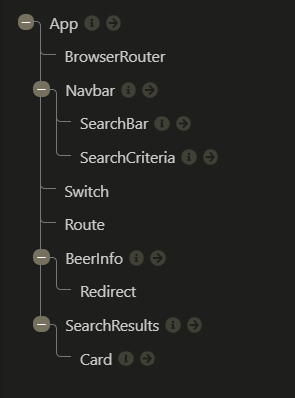

# Feedback

Right click on the file and click Open Preview or `ctrl/cmd + shift + v` to open preview

## Goals

1. Working beers web app - done
2. Practice using API and React - done
3. Application of what you're learning (React, Fetch etc.) - done

## Specification

### Start

> "All the wire frame content in black is the first part of the challenge - that is, the nav, the main section containing the beers and beer cards for each piece of data."



Your component tree looks great you have matched the wire frame & component tree from the brief.

When you are building things in React have a go at breaking your project into a component tree before you go in with the code. It will help you out manage all of the moving pieces.

### Extension 1

> "Once you've got the design and layout sorted to render the elements, it's time to add some search functionality. Make it so you can search the beers by their name, and the page content should update as you type each letter in the box."

The aim of this extension is to get you using functions as props. You have a function in your app `handleInput()` that you are passing down to the `<Navbar/>` which then passes it to your `<SearchBar/>` which captures the input and passes it back up.

This is great breaking applications into components is the relatively simple part of an application. Connecting them is the tricky part so keep it up!

### Extension 2

> Finally attempt to make it so you can filter the content on three conditions:
>
> > - High Alcohol (ABV value greater than 6%)
> > - Classic Range (Was first brewed before 2010)
> > - High Acidity (pH lower than 4)
> > - If you can’t achieve this after a good attempt, then feel free to move on to the final extension.

Brilliant! you have got all of the filters working. You have multiple functions in the app working as state toggles which you are storing in a array. The function to update them gets passed to the `<navBar/>` and gets given to `<SearchCriteria/>` when called in that component it gets the index and updates the correct boolean. Based on the array this is how you determine the URL which your send to the API.

The ph is slightly different but similar idea. There is a little bug when you un toggle the ph check, it doesn't refresh the page. The problem is that it is in a separate `useEffect()` that would have to call the fetch again to get the data again when it is false. A simple fix is not to remove anything from your data. If it is true then you filter but do not set it to state.

```jsx
// App.jsx - outside a useEffect above the return
let filteredBeers = beersArr;

if (checkedPh) {
  filteredBeers = beersArr.filter(beer => beer.ph < 4 && beer.ph);
}

// filteredBeers beers is given to the component that needs it
```

Its good that you got the filter's working, now is the time to refactor. You have some neat things going on in your code but you could simplify them.

I like your `searchcriteria.js` even though it should be `searchCriteria.js`. Why not store the toggle state on it?

```js
// searchcriteria.js
  {
    id: "abv",
    text: "Search only for beers above 6%",
    search: "&abv_gt=6",
    isActive: false,
  }
```

Now you would just update where you set the state to use the values.
`const [checkedState, setCheckedState] = useState(searchCriteria.map(criteria => criteria.isActive));`

I think you can simplify your `useEffect()`. You are doing similar thing in each block e.g the fetch.

```jsx
// App.jsx 40
useEffect(() => {
  // fixes problems with empty strings
  if (!searchTerm) {
    fetch(`https://api.punkapi.com/v2/beers?per_page=80&${additionalTerms}`)
      .then(res => {
        return res.json();
      })
      .then(data => {
        return setBeersArr(data);
      });
  } else {
    // returns search results on keystrokes
    fetch(`https://api.punkapi.com/v2/beers?${additionalTerms}&per_page=80&beer_name=${searchTerm}?`)
      .then(res => {
        return res.json();
      })
      .then(data => {
        return setBeersArr(data);
      });
  }
}, [searchTerm, additionalTerms]);
```

You can simplify it but just updating the URL and then call the `fetch()`.

```jsx
useEffect(() => {
  let URL = `https://api.punkapi.com/v2/beers?per_page=80`;

  checkedState.forEach((item, index) => {
    if (item) {
      URL += searchCriteria[index].search;
    }
  });

  if (searchTerm) {
    URL += `&beer_name=${searchTerm}`;
  }

  fetch(URL)
    .then(res => {
      return res.json();
    })
    .then(data => {
      return setBeersArr(data);
    });
}, [checkedState, searchTerm]);
```

### Extension 3

> Style the website however you see fit! Go wild!

It looks okay on a large monitor. You need to address the styles for other devices.

To save you time so you can focus on functionality have a read of this [CSS-Grid Article](https://css-tricks.com/look-ma-no-media-queries-responsive-layouts-using-css-grid/)

You can use it to make your cards responsive in one line.

## Overall

Very well componentised code across the board.

You have multiple functions being passed across your application. All of the functionality has been added. I can see you are adding routing which will be interesting :). Let me know if you need a hand.

I feel confident with your understanding of useState, useEffect and funcs as props.

Awesome mate good going! I think this project has the most functionality in a project you have completed! I can't wait to see what you build next.

## To work on

Make the project responsive. This project is great in terms of functionality. If you resolve the points above, you will be able just to focus on styles. 

Update the readme.md so it is not the auto generated file.

I think if you address the above you are cool.

Final notes, when you run a react app, your terminal shows you warnings. These are generally easily googleable and simple to fix and will improve code quality. So always keep one eye on your terminal while coding in react.
